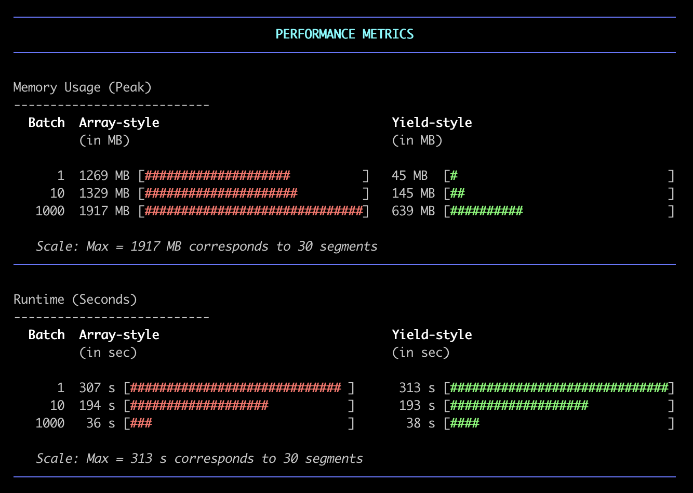

# GSC API Client - A PHP Class for Easy-Peasy Data Retrieval from Google Search Console

A **PHP client** for the Google Search Console API that makes it easy to import search performance data programmatically into your application.

## Table of Contents

- [Requirements](#requirements)
- [Installation](#installation)
- [Usage Examples](#usage-examples)
  - [Example Files](#example-files)
  - [Initialize the Client](#initialize-the-client)
  - [List Available Properties](#list-available-properties)
  - [Select a Property](#select-a-property)
  - [Set Date Range](#set-date-range)
  - [Get Search Performance Data](#get-search-performance-data)
  - [Configure Batch Processing](#configure-batch-processing)
  - [Accessing Returned Keyword Data](#accessing-returned-keyword-data)
  - [Accessing Returned URL Data](#accessing-returned-url-data)
- [Return Values](#return-values)
  - [Keyword Data Structure](#keyword-data-structure)
  - [URL Data Structure](#url-data-structure)
  - [Search Performance by URL Data Structure](#search-performance-by-url-data-structure)
- [API Reference](#api-reference)
- [Speed and Resource Requirements](#speed-and-resource-requirements)
  - [Tested with Large-ish GSC Accounts](#tested-with-large-ish-gsc-accounts)
    - [Test Results](#test-results)
      - [Batch=1 (the long way round)](#batch1-the-long-way-round)
      - [Batch=10 (getting somewhere)](#batch10-getting-somewhere)
      - [Batch=1000 (now we're cooking)](#batch1000-now-were-cooking)
      - [How to find a good BatchSize](#how-to-find-a-good-batchsize)
  - [Real-World Performance Test](#real-world-performance-test)
- [Google's Table Schema](#googles-table-schema)
  - [Table `searchdata_site_impression`](#table-searchdata_site_impression)
  - [Table `searchdata_url_impression`](#table-searchdata_url_impression)
- [Additional Resources](#additional-resources)

## Requirements

Nothing fancy here:

- PHP 8.2+
- Google Search Console API credentials
- A GSC property that actually has some data in it

## Installation

The GSC API Client is available as Composer package, which is most likely the easiest way to use this library.

So, to install it via Composer:

```bash
composer require abromeit/gsc-api-client:dev-main
```

Before you can start pulling data, you'll need to:

1. Set up a Google Cloud Project and enable the Search Console API
2. Create credentials (we use service accounts)
3. Download your JSON credentials file
4. Give your service account email access to your GSC properties

## Usage Examples

### Example Files

Check out these ready-to-use examples in the `examples/` directory:

- [`get-all-properties.php`](examples/get-all-properties.php) - List all GSC properties you have access to
- [`get-top3-keywords-per-day.php`](examples/get-top3-keywords-per-day.php) - Get the top 3 keywords for each day
- [`get-top3-urls-per-day.php`](examples/get-top3-urls-per-day.php) - Get the top 3 URLs for each day

### Initialize the Client

```php
use Abromeit\GscApiClient\GscApiClient;
use Google\Client;
use Google\Service\SearchConsole;

// Initialize with service account
$googleClient = new Client();
$googleClient->setAuthConfig('/path/to/service-account.json');
$googleClient->addScope(SearchConsole::WEBMASTERS_READONLY);

$apiClient = new GscApiClient($googleClient);
```

### List Available Properties

Want to see what properties you have access to? Easy:

```php
$properties = $apiClient->getProperties();
foreach ($properties as $property) {
    echo $property->getSiteUrl() . "\n";
    echo "Permission Level: " . $property->getPermissionLevel() . "\n";
}
```

### Select a Property

Pick your poison:

```php
// Using URL
$apiClient->setProperty('https://example.com/');

// Using domain property
$apiClient->setProperty('sc-domain:example.com');
```

### Set Date Range

Need last week's data? Got you covered:

```php
// Last 7 days
$startDate = (new DateTime('today'))->sub(new DateInterval('P7D'));
$endDate = new DateTime('today');
$apiClient->setDates($startDate, $endDate);

// Or if you need specific dates
$apiClient->setDates(
    new DateTime('2024-01-01'),
    new DateTime('2024-01-31')
);
```

### Get Search Performance Data

Aaand here's where the magic happens:

```php
// Get daily performance data
$keywordData = $apiClient->getTopKeywordsByDay();

// Get URL data (max 25k rows per request)
$urlData = $apiClient->getTopUrlsByDay();

// Want fewer rows? No problem
$keywordData = $apiClient->getTopKeywordsByDay(100);
$urlData = $apiClient->getTopUrlsByDay(10);

// Get comprehensive search performance data
$performanceData = $apiClient->getSearchPerformanceByUrl();

// Filter by country (ISO-3166-1-Alpha-3, because apparently ISO codes weren't confusing enough)
$apiClient->setCountry('USA');

// Filter by device type (DESKTOP, MOBILE, TABLET)
$apiClient->setDevice(\Abromeit\GscApiClient\Enums\GSCDeviceType::MOBILE);
// or just
$apiClient->setDevice('MOBILE');

// Clear individual filters
$apiClient->setCountry(null);
$apiClient->setDevice(null);
$apiClient->setSearchType(null);

// Create custom dimension filters
$queryFilter = $apiClient->getNewApiDimensionFilterGroup('query', 'foo bar'); // "query = foo bar"
$queryFilter = $apiClient->getNewApiDimensionFilterGroup('query', 'foo bar', 'contains'); // "query *= foo bar"
```

### Configure Batch Processing

See https://developers.google.com/webmaster-tools/v1/how-tos/batch

```php
// Get current batch size
$batchSize = $apiClient->getBatchSize();

// Set number of requests to batch together (1-1000)
// Pro tip: Set this BEFORE calling methods that hit the API >.<'
$apiClient->setBatchSize(10);
```

### Accessing Returned Keyword Data

Here's how to access returned GSC data:

```php
$keywordData = $apiClient->getTopKeywordsByDay();

foreach ($keywordData as $row) {
    echo "Date: {$row['data_date']}\n";
    echo "Query: {$row['query']}\n";
    echo "Position: ".number_format($row['position'], 1)."\n";
    echo "Clicks: {$row['clicks']}\n";
    echo "Impressions: {$row['impressions']}\n";
    echo "Sum Top Position: {$row['sum_top_position']}\n";
}
```

### Accessing Returned URL Data

Same assoc result array, but for URLs:

```php
$urlData = $apiClient->getTopUrlsByDay();

foreach ($urlData as $row) {
    echo "Date: {$row['data_date']}\n";
    echo "URL: {$row['url']}\n";
    echo "Position: ".number_format($row['position'], 1)."\n";
    echo "Clicks: {$row['clicks']}\n";
    echo "Impressions: {$row['impressions']}\n";
    echo "Sum Top Position: {$row['sum_top_position']}\n";
}
```

## Return Values

The data structure matches Google's BigQuery schema (thanks Google for at least being consistent here). If you're curious about the details: https://support.google.com/webmasters/answer/12917991?hl=en

### Keyword Data Structure

Here's what you get for each keyword row:

```php
/* <Generator> */
    [
        'data_date' => string,         // Format: YYYY-MM-DD
        'site_url' => string,          // Property URL
        'query' => string,             // Search query
        'country' => ?string,          // Optional: ISO-3166-1-Alpha-3 country code
        'device' => ?string,           // Optional: DESKTOP, MOBILE, or TABLET
        'impressions' => int,          // Total impressions
        'clicks' => int,               // Total clicks
        'position' => float,           // Average 1-based position
        'sum_top_position' => float    // Sum of (position-1)*impressions
    ],
    // etc.
/* </Generator> */
```

### URL Data Structure

And here is how a result row looks like for URLs:

```php
/* <Generator> */
    [
        'data_date' => string,         // Format: YYYY-MM-DD
        'site_url' => string,          // Property URL
        'url' => string,               // Page URL
        'country' => ?string,          // Optional: ISO-3166-1-Alpha-3 country code
        'device' => ?string,           // Optional: DESKTOP, MOBILE, or TABLET
        'impressions' => int,          // Total impressions
        'clicks' => int,               // Total clicks
        'position' => float,           // Average 1-based position
        'sum_top_position' => float    
    ],
    // etc.
/* </Generator> */
```

### Search Performance by URL Data Structure

Here is the rather comprehensive result for the full "Search Performance by URL".

```php
/* <Generator> */
    [
        'data_date' => string,         // Format: YYYY-MM-DD
        'site_url' => string,          // Property URL
        'url' => string,               // Page URL
        'query' => string,             // Search query that led to the page
        'country' => string,           // ISO-3166-1-Alpha-3 country code
        'device' => string,            // DESKTOP, MOBILE, or TABLET
        'impressions' => int,          // Total impressions
        'clicks' => int,               // Total clicks
        'position' => float,           // Average 1-based position
        'sum_top_position' => float    
    ],
    // etc.
/* </Generator> */
```

## API Reference

Here's everything you can do with the `GscApiClient` class. No magic, sadly ;)

| Method Signature | Return Type | Description |
|-----------------|-------------|-------------|
| `__construct(Client $client)` | `void` | Initializes a new GSC API client instance |
| `getBatchSize()` | `int` | Gets the current batch size setting |
| `setBatchSize(int $batchSize)` | `self` | Sets number of requests to batch (1-1000) |
| `getProperties()` | `WmxSite[]` | Gets all properties the user has access to |
| `setProperty(string $siteUrl)` | `self` | Sets the property to work with |
| `getProperty()` | `string \| null` | Gets the currently set property URL |
| `hasProperty()` | `bool` | Checks if a property is set |
| `isDomainProperty([?string $siteUrl=null])` | `bool` | Checks if URL is a domain property |
| `setStartDate(DateTimeInterface $date)` | `self` | Sets the start date |
| `setEndDate(DateTimeInterface $date)` | `self` | Sets the end date |
| `setDates(DateTimeInterface $startDate, DateTimeInterface $endDate)` | `self` | Sets both start and end dates |
| `clearStartDate()` | `self` | Clears the start date |
| `clearEndDate()` | `self` | Clears the end date |
| `clearDates()` | `self` | Clears both dates |
| `getStartDate()` | `DateTimeInterface \| null` | Gets the start date |
| `getEndDate()` | `DateTimeInterface \| null` | Gets the end date |
| `getDates()` | `array{start: DateTimeInterface \| null, end: DateTimeInterface \| null}` | Gets both dates |
| `hasStartDate()` | `bool` | Checks if start date is set |
| `hasEndDate()` | `bool` | Checks if end date is set |
| `hasDates()` | `bool` | Checks if both dates are set |
| `setCountry([?string $countryCode=null])` | `self` | Sets country using ISO-3166-1-Alpha-3 code |
| `getCountry()` | `string \| null` | Gets the current country |
| `hasCountry()` | `bool` | Checks if a country filter is set |
| `setDevice([DeviceType\|string\|null $deviceType=null])` | `self` | Sets device type |
| `getDevice()` | `string \| null` | Gets the current device type |
| `hasDevice()` | `bool` | Checks if a device filter is set |
| `setSearchType([?string $searchType=null])` | `self` | Sets search type (e.g., 'WEB', 'NEWS') |
| `getSearchType()` | `string \| null` | Gets the current search type |
| `getNewApiDimensionFilterGroup(string $dimension, string $expression, [string $operator=\'equals\'])` | `ApiDimensionFilterGroup` | Creates a dimension filter group for custom filtering |
| `getTopKeywordsByDay([?int $maxRowsPerDay=null])` | `Generator<array{data_date: string, site_url: string, query: string, country: string \| null, device: string \| null, impressions: int, clicks: int, sum_top_position: float}>` | Gets top keywords by day |
| `getTopUrlsByDay([?int $maxRowsPerDay=null])` | `Generator<array{data_date: string, site_url: string, url: string, country: string \| null, device: string \| null, impressions: int, clicks: int, sum_top_position: float}>` | Gets top URLs by day |
| `getSearchPerformanceByUrl()` | `Generator<array{data_date: string, site_url: string, url: string, query: string, country: string, device: string, impressions: int, clicks: int, sum_top_position: float}>` | Gets all available columns from `byPage` aggregated data sources |
| `getRequestsPerSecond([int $seconds=1])` | `float` | Gets the current average API queries per second |
| `getTotalRequests([int $seconds=60])` | `int` | Gets the total number of API queries made |

## Speed and Resource Requirements

We've updated the GSC API Client to use a yield-style implementation because waiting for the entire dataset to load before processing is no fun. Here's what you get:

- Data starts flowing as soon as it's available _(effectively **streaming** it)_
- The BatchSize config option now allows us to choose of either speed or memory efficiency. _(I'd love to say "and any point in between", but in reality even small batch sizes can result in substantial HTTP response sizes. - which unsuprisingly affects the memory footprint our application has.)_

### Tested with Large-ish GSC Accounts

These numbers are from a local dev machine running who-knows-what in the background - so take them with a grain of salt. But you'll see the pattern.

We grabbed 16 months of daily data using `getTopKeywordsByDay()`. This function uses the "byProperty" aggregation, which seemingly means you get the top 5k entries (keywords) per day. (This behavior is only … "implicitly" documented. You'll most likely find numbers around 25k+ rows in the documentation. These exist, just not here.)

The result is 499 days of data in 2,495,000 rows. Each row contains a keyword with its `impressions`, `clicks`, and `ctr` for a single day.


#### Test Results

<ins>**NOTE: This data reflects a software version before the implementation of the ThrottlingMiddleware. Consequently, performance metrics may differ from the current version, which enforces API request limits.**</ins>



| Implementation | Batch Size | Peak Memory   | Runtime             |
|----------------|------------|---------------|---------------------|
| Array-style    | 1          | 1269 MB       | 307s (5.1m)         |
| Yield-style    | 1          | 45 MB  (-96%) | 290s (4.8m)         |
| Yield-style    | 5          | 86 MB         | 188s (3.1m)         |
| Array-style    | 10         | 1329 MB       | 194s (3.2m)         |
| Yield-style    | 10         | 145 MB (-89%) | 183s (3.1m)         |
| Yield-style    | 15         | 205 MB        | 189s (3.2m) // sic! |
| Array-style    | 1000       | 1917 MB       | 36s  (0.6m)         |
| Yield-style    | 1000       | 639 MB (-67%) | 38s  (0.6m)         |

##### Batch=1 (the long way round):

- One HTTP request per day = 498 separate, sequential connections with handshakes, headers, waiting for the response from google, the whole deal
- Array version: **1.2GB RAM**, 5.1min runtime _(congratulations, you now have time to check your unread emails)_
- Yield version: <ins>**45MB RAM**</ins>, but same glacial speed _(because physics)_

##### Batch=10 (getting somewhere):

- Runtime drops to ~3.2min by bundling into ~50 requests
- Memory stays manageable with yield (145MB)
- Array version still hoarding RAM like it's mining crypto (1.3GB)

##### Batch=1000 (now we're cooking):

- 36-38 seconds runtime with just 1-2 connections total
- Memory jumps to 1.9GB array / 639MB yield
- If your server has the RAM, this is probably what you want, right?

##### How to find a good BatchSize

The yield implementation keeps memory in check while matching speed. 
But note that Google enforces a per-site quota of `20 requests per second` = `120 api calls per minute` (see [Google's QPS Quota](https://developers.google.com/webmaster-tools/limits?hl=en#qps-quota)). Higher batch sizes will make you feel good about some measured metrics, but they're lying to you - the API is just dropping your requests.

**Stick to batch sizes below 20** unless you are fully aware of the implications, as exceeding the quota can lead to unnecessarily long runtimes. Which is the opposite of what you want.

##### Real-World Performance Test

<ins>**NOTE: The following performance metrics reflect measurements taken with the "current" software version, which includes ThrottlingMiddleware for API request rate limiting. These results supersede the data shown above.**</ins>

Here is another test fetching 3 months of data using `getSearchPerformanceByUrl()` with various batch sizes. These are the results:

| Batch Size | Total Rows | Peak Memory | Avg Memory | Runtime | Rows/Second | QPS |
|------------|------------|-------------|------------|---------|-------------|-----|
| 1          | 4,505,486  | 118.1 MB    | 85.4 MB    | 491.6s  | 9,165      | 0.37 |
| 20         | 4,505,486  | 707.4 MB    | 539.4 MB   | 171.4s  | 26,283     | 1.07 |
| 75         | 4,505,486  | 1,362.2 MB  | 1,017.3 MB | 150.3s  | 29,984     | 1.22 |
| 175        | 4,505,486  | 3,386.8 MB  | 2,229.5 MB | 142.8s  | 31,547     | 1.29 |

- 91 days of data (2024-11-06 to 2025-02-06)
- ~49,510 rows per day (min: 48,860, max: 49,772) 
- Total data volume: 4.5M rows, ~1.2GB compressed JSON


## Google's Table Schema

Thinking about GSC data can be a real head-scratcher sometimes. At every corner, certain information might be missing or needs to be interpreted in a specific way to arrive at meaningful results. Fortunately, it helps to look at how Google itself handles the same data. _Ooo-wee!_

So - if you export your GSC data to BigQuery, you will find the following situation in the tables.

### Table `searchdata_site_impression`

This table contains data aggregated by property. The table contains the following fields:

| Field                | Type    | Description                                                                                                                                                                                                 |
|----------------------|---------|-------------------------------------------------------------------------------------------------------------------------------------------------------------------------------------------------------------|
| data_date            | string  | The day on which the data in this row was generated (Pacific Time).                                                                                                                                         |
| site_url             | string  | URL of the property. For domain-level properties, this will be `sc-domain:property-name`. For URL-prefix properties, it will be the full URL of the property definition. Examples: `sc-domain:developers.google.com`, `https://developers.google.com/webmaster-tools/`. |
| query                | string  | The user query. When `is_anonymized_query` is true, this will be a zero-length string.                                                                                                                      |
| is_anonymized_query  | boolean | Rare queries (called anonymized queries) are marked with this bool. The query field will be null when it's true to protect the privacy of users making the query.                                           |
| Country              | string  | Country from where the query was made, in ISO-3166-1-Alpha-3 format.                                                                                                                                       |
| search_type          | string  | One of the following string values: `web`, `image`, `video`, `news`, `discover`, `googleNews`.                                                                                                             |
| device               | string  | The device from which the query was made.                                                                                                                                                                   |
| impressions          | integer | The number of impressions for this row.                                                                                                                                                                     |
| clicks               | integer | The number of clicks for this row.                                                                                                                                                                          |
| sum_top_position     | float   | The sum of (position-1) * impressions. Allows further aggregation of position data. |
| position             | float   | The average 1-based position as reported directly by the GSC API. |

### Table `searchdata_url_impression`

This table contains data aggregated by URL. The table contains the following fields:

| Field                   | Type    | Description                                                                                                                                                                                                 |
|-------------------------|---------|-------------------------------------------------------------------------------------------------------------------------------------------------------------------------------------------------------------|
| data_date               | string  | Same as above.                                                                                                                                                                                              |
| site_url                | string  | Same as above.                                                                                                                                                                                              |
| url                     | string  | The fully-qualified URL where the user eventually lands when they click the search result or Discover story.                                                                                               |
| query                   | string  | Same as above.                                                                                                                                                                                              |
| is_anonymized_query     | boolean | Same as above.                                                                                                                                                                                              |
| is_anonymized_discover  | boolean | Whether the data row is under the Discover anonymization threshold. When under the threshold, some other fields (like URL and country) will be missing to protect user privacy.                             |
| country                 | string  | Same as above.                                                                                                                                                                                              |
| search_type             | string  | Same as above.                                                                                                                                                                                              |
| device                  | string  | Same as above.                                                                                                                                                                                              |
| is_[search_appearance_type] | boolean | There are several boolean fields used to indicate search appearance type, such as `is_amp_top_stories`, `is_job_listing`, and `is_job_details`. A field will be true if the row in question appears for the specific rich result. |
| impressions             | integer | Same as above.                                                                                                                                                                                              |
| clicks                  | integer | Same as above.                                                                                                                                                                                              |
| sum_position            | float   | A zero-based number indicating the topmost position of this URL in the search results for the query. (Zero is the top position in the results.) To calculate average position (which is 1-based), calculate `SUM(sum_position)/SUM(impressions) + 1`. |

## Additional Resources

For more details on topics discussed in this GSC API Client's Readme file, refer to the official documentation and guidelines provided by Google:

- **Batch Requests:** [Google Search Console API Batch Requests](https://developers.google.com/webmaster-tools/v1/how-tos/batch?hl=en)
- **API Request Limits:** [Google Search Console API Limits and Quotas](https://developers.google.com/webmaster-tools/limits?hl=en#qps-quota)
- **Getting Started with the Search Console API:** [Quickstart - Search Console API](https://developers.google.com/webmaster-tools/v3/quickstart)
- **Setting Up Service Accounts:** [Using Service Accounts](https://developers.google.com/identity/protocols/oauth2/service-account)
